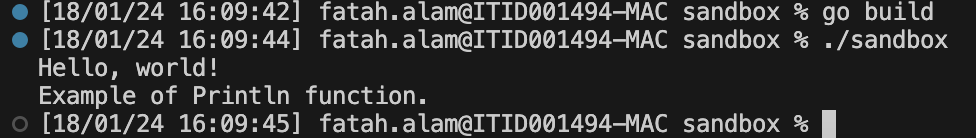
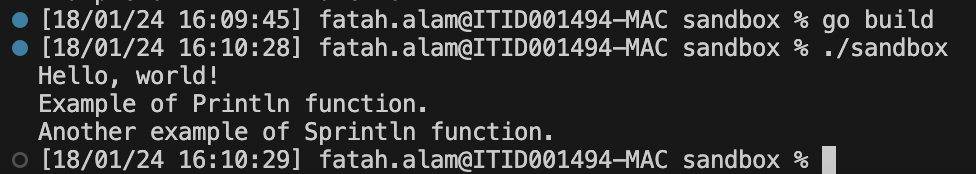
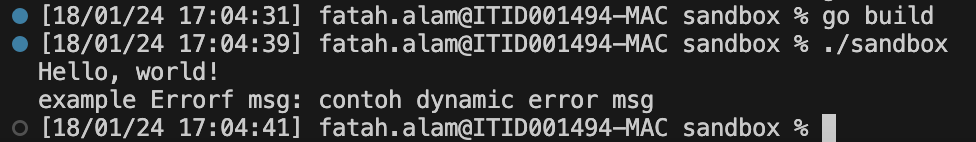
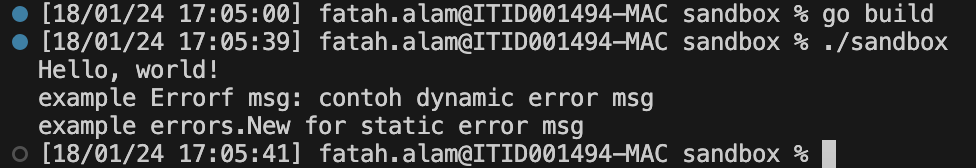

1. Bagaimanakah dependency management dalam golang?

    Jawab:

    Golang mengatur/manage dependencies menggunakan module. Module tsb di-define menggunakan file `go.mod` yg melacak/track module-module lain yg menyediakan suatu package yg kita pakai di dalam code kita. File `go.mod` ini nantinya akan kita simpan di dalam project/repository kita dan akan kita jaga/maintain selama kita menggunakan project kita ini.

2. Jelaskan kegunaan function fmt.Sprintln apa bedanya dengan fmt.Println? Beri contoh code, copy-paste outputnya.

    Jawab:

    Fungsi `Println` adalah untuk mencetak/print sebuah string ke standard output (stdout), dan mengembalikan 2 variable yaitu total byte yg ditulis dan error ketika fungsi mencetak. Sedangkan fungsi `Sprintln` mirip dengan fungsi `Println` tetapi tidak mencetak/print string ke stdout namun mengembalikan string tsb sebagai balikan / return value. Apabila kita ingin mencetak string yg didapat dari fungsi `Sprintln` maka kita memerlukan fungsi lain yaitu `io.WriteString()`.

    Contoh kode `Println`:

    ```go
    fmt.Println("Example of Println function.")
    ```

    Output:

    

    Contoh kode `Sprintln`:

    ```go
    s := fmt.Sprintln("Another example of Sprintln function.")
	io.WriteString(os.Stdout, s)
    ```

    Output:

    

    Contoh kode juga dapat dilihat di file [main.go](../main.go).

3. Jelaskan kegunaan function fmt.Errorf apa bedanya dengan errors.New? Beri contoh code, copy-paste outputnya.

    Jawab:

    Fungsi `errors.New` adalah untuk membuat suatu error dengan text tertentu sesuai string yg digunakan di parameter, dan hanya menerima 1 parameter saja. Sedangkan fungsi `fmt.Errorf` mirip dengan fungsi `errors.New` hanya saja fungsi ini menerima minimal 2 parameter, yaitu parameter pertama adalah format/template dari string error yg diinginkan, dan parameter kedua adalah untuk nilai/value dari format/template tsb. Kedua fungsi ini (`errors.New` dan `fmt.Errorf`) sama-sama mengembalikan error sebagai nilai balikan.

    Contoh kode `fmt.Errorf`:

    ```go
    errcontent := "contoh dynamic error msg"
	err := fmt.Errorf("example Errorf msg: %s", errcontent)
	fmt.Println(err)
    ```

    Output:

    

    Contoh kode `errors.New`:

    ```go
    err2 := errors.New("example errors.New for static error msg")
	fmt.Println(err2)
    ```

    Output:

    

    Contoh kode juga dapat dilihat di file [main.go](../main.go).
